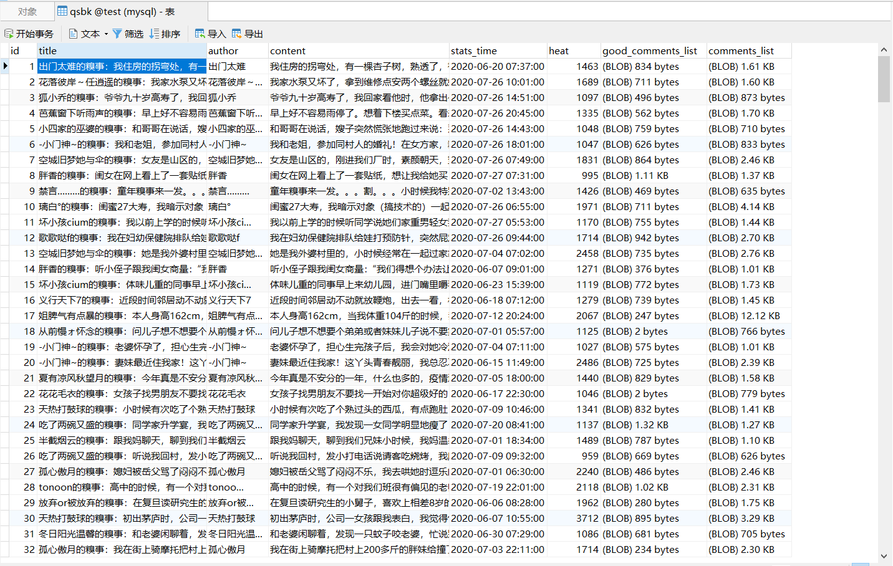
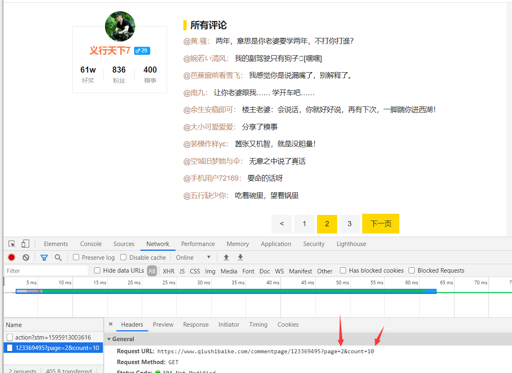
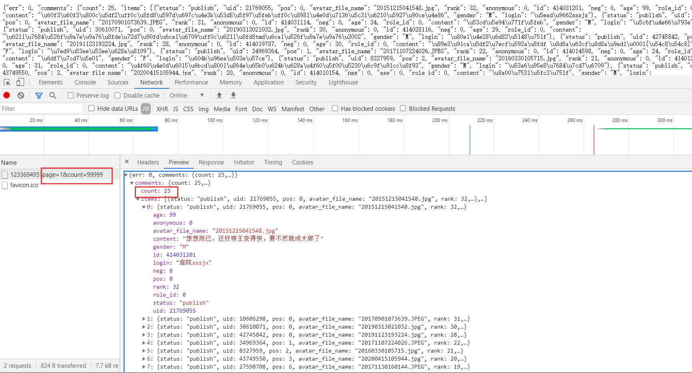

# 糗事百科爬虫

## 项目介绍
该项目是基于Scrapy框架的爬取糗事百科段子的爬虫, 爬取后的数据存在关系型数据库MySQL中

例如[https://www.qiushibaike.com/text/page/1/](https://www.qiushibaike.com/text/page/1/)

需要解析当前页面全部段子的url, 再发送请求解析获取需要爬取的数据

该项目只爬取了 段子标题, 作者， 内容，发布时间，热度，神评，全部评论

## 项目环境
* 操作系统：Windows10
* Python版本: 3.6.8
* Scrapy版本: 2.0.0
* MySQL版本: 8.0.12
* IDE: PyCharm2020.1.4
## 使用方法
1. 克隆代码到本地并解压打开项目(环境在[requirements.txt](requirements.txt))
    ~~~ 
    clone git@github.com:huangsiyuan924/qsbk_spider.git
    ~~~
2. MySQL创建数据库test(可自行在文件[MysqlUtil.py](demo1/MysqlUtil.py)中更改数据库名) 
   数据表可在爬虫执行时自动创建 
   title 段子标题 
   author 段子作者 
   content 段子内容 
   stats_time 发布时间 
   heat 段子热度 
   good_comments_list 该段子神评 
   comments_list 段子所有评论 
   
   ~~~sql
   CREATE TABLE IF NOT EXISTS qsbk(
                        id INT PRIMARY KEY AUTO_INCREMENT,
                        title VARCHAR(150) NOT NULL,
                        author VARCHAR(30) NOT NULL,
                        content TEXT NOT NULL,
                        stats_time DATETIME NOT NULL,
                        heat INT NOT NULL,
                        good_comments_list BLOB,
                        comments_list BLOB
                        )
   ~~~
3. 运行[run_qsbk.py](demo1/run_qsbk.py)即可爬取数据到MySQL当中

    

## 部分代码说明

​	   在获取所有评论(comments_list)时， 需要翻页动态获取，通过谷歌开发者工具可以看到点击其他页评论后会发送一个Get请求，我的第一种方法是获取页面个数， 即那几个按钮所有li标签的个数-2， 不断发送请求，但是后来发现可以直接page=1，count=99999就可以返回所有评论json

​       例如：https://www.qiushibaike.com/commentpage/123369495?page=2&count=10

​																					|--------会返回第二页的10条评论

​			 	 https://www.qiushibaike.com/commentpage/123369495?page=1&count=99999

​																				    |--------会返回所有评论（不会有的段子超过99999个评论吧）

~~~python
res = json.loads(response.body)['comments']
# 评论数
comments_num = res['total']
# 段子的所有评论
comments_list = []
for i in range(comments_num):
# 将用户名和评论内容拼接起来放入list
comments_list.append([res['items'][i]['login'], res['items'][i]['content']])
~~~

